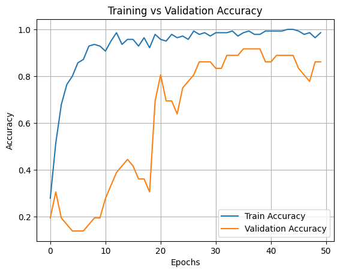
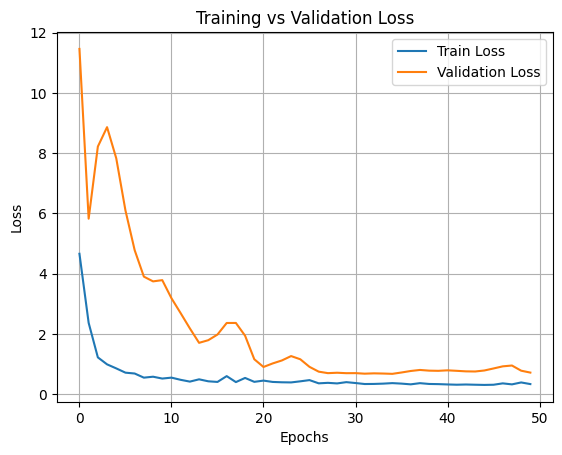

# Audio Distress Detection using Machine Learning

This project implements a voice-based emergency command detection system to identify distress phrases such as "help" and "bachao" from audio input using MFCC features and machine learning models.

The system is designed to detect emergency voice commands in noisy environments and can be used as a trigger for safety applications.

---

## Overview

The goal of this project is to classify short audio clips into predefined emergency-related command categories using classical signal processing and machine learning techniques.

The pipeline includes:

- Audio preprocessing  
- MFCC feature extraction  
- Noise augmentation  
- Model training and evaluation  
- Inference on unseen audio samples  

---

## Dataset

A custom dataset was collected from volunteers containing English and Hindi emergency-related phrases.

### Dataset details

- Total samples: **220**
- Speakers: Male and Female  
- Languages: English, Hindi  
- Data augmentation: White noise injection  
- Classes: 6  

### Data split

- Training set: **140 samples**
- Validation set: **36 samples**
- Test set: **44 samples**

> Note: Audio samples are not included in this repository due to privacy considerations of the volunteers.

---

## Feature Extraction

- MFCC (Mel-Frequency Cepstral Coefficients) extracted from raw audio  
- Frame-level aggregation to form fixed-length feature vectors  
- Final input shape: `(64, 32)` per sample  

---

## Model

- Neural network classifier trained on MFCC features  
- Optimized using categorical cross-entropy loss  

---

## Pipeline

1. Audio preprocessing  
2. MFCC feature extraction  
3. Noise augmentation  
4. Model training  
5. Validation and evaluation  
6. Inference testing  

---

## Evaluation

### Training Performance (final epochs)

- Training Accuracy: **~99–100%**
- Validation Accuracy: **~86–89%**
- Final Validation Loss: **0.719**

> Slight overfitting is observed due to limited dataset size, which is expected for small custom audio datasets.

---

### Classification Report (Test Set – 44 samples)

| Class | Precision | Recall | F1-score | Support |
|-------|-----------|--------|-----------|----------|
| 0 | 0.83 | 0.83 | 0.83 | 6 |
| 1 | 0.89 | 1.00 | 0.94 | 8 |
| 2 | 0.62 | 1.00 | 0.77 | 10 |
| 3 | 1.00 | 0.71 | 0.83 | 7 |
| 4 | 0.83 | 0.71 | 0.77 | 7 |
| 5 | 1.00 | 0.33 | 0.50 | 6 |

**Overall Test Accuracy:** **80%**  
**Macro F1-score:** **0.77**  
**Weighted F1-score:** **0.78**

---

### Confusion Matrix

[[ 5 0 1 0 0 0]
[ 0 8 0 0 0 0]
[ 0 0 10 0 0 0]
[ 1 0 1 5 0 0]
[ 0 0 2 0 5 0]
[ 0 1 2 0 1 2]]

### Results Summary
- High precision and recall for most classes
- Some confusion between similar-sounding commands
- Room for improvement in minority classes
>I added the traing and validation accuracy and loss plots below for reference.

---

### Additional Testing

- Tested on high-intensity screaming samples (2 cases)  
- Model correctly classified both as distress speech  

> Note: Screaming samples are not included in the repository due to privacy concerns.S

---

## Limitations

- Small dataset size  
- Class imbalance  
- Limited accent and environment diversity  
- No real-world deployment testing  

---

## Future Work

- Expand dataset with more speakers and environments  
- Improve robustness using deep learning speech models (CNN/RNN/Transformers)  
- Real-time deployment on mobile or edge devices  
- Multilingual expansion  
- Integration with emergency response systems
- User interface development for ease of use

---

## Usage
1. Clone the repository
2. Install required dependencies
3. Run the training script to train the model
4. Use the inference script to test on new audio samples
5. Refer to the code comments for detailed instructions

---
### Authors
- AJ
